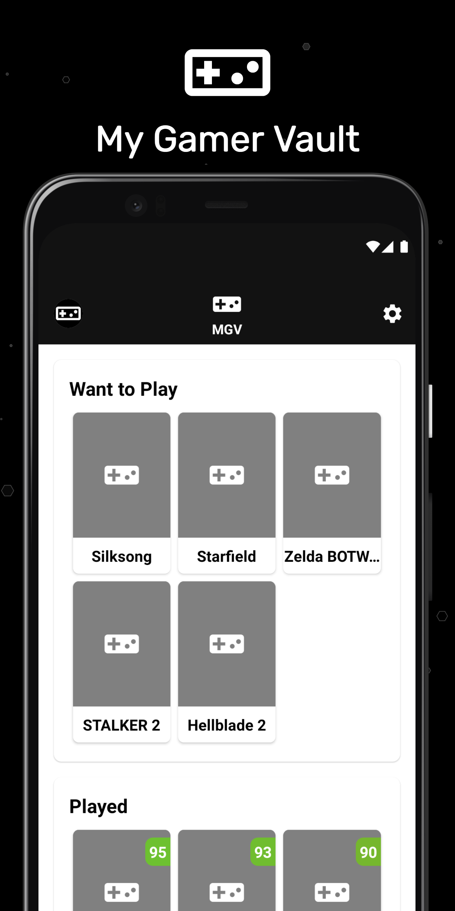
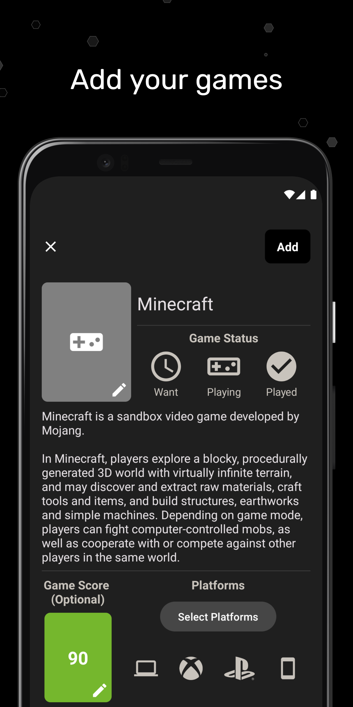
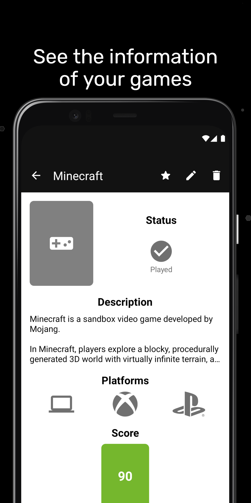
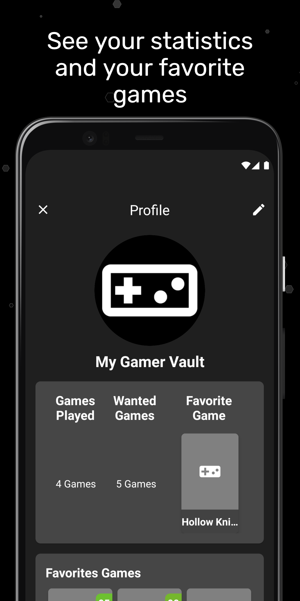
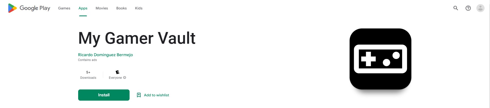

# My Gamer Vault
My Gamer Vault is an application to register and organize your video game collection with ease and a variety of options.
This app was my second project on Android Development, develop in a single month on June 2022.

## Main features
- Add your video games and organize them into different categories, such as the game I want to play, playing or game played, where you can put a rating based on your experience with the game and an opinion. You can also add which platforms you'll be playing on and a cover image of the game. 
- You will be able to see the specific information of each game in addition to being able to edit it or mark it as one of your favorites. 
- In your profile, you will be able to see some statistics about your games in addition to seeing a list with your games marked as favorites.

## Screenshots
| Home | Add Games | Games Information | Gamer Profile |
| ---- | --------- | ----------------- | ------------- |
|  |  |  |  |

## Used Technologies & Open-Source libraries
- Minimum SDK level 23
- [Kotlin](https://kotlinlang.org/) based
- Jetpack
	- Lifecycle: Observe Android lifecycles and handle UI states upon the lifecycle changes.
	- ViewModel: Manages UI-related data holder and lifecycle aware. Allows data to survive configuration changes such as screen rotations.
	- Room: Constructs Database by providing an abstraction layer over SQLite to allow fluent database access.
- [Glide](https://github.com/bumptech/glide): Loading images from network.
- [CircleImageView](https://github.com/hdodenhof/CircleImageView): A circular ImageView perfect for profile images.
- [UCrop](https://github.com/Yalantis/uCrop): Image Cropping Library for Android.
- [Gson](https://github.com/google/gson): A Java library that can be used to convert Java Objects into their JSON representation.
- [Firebase](https://firebase.google.com/): For functionalities Crashlytics and Analytics.
- 
## Google Play
The application is available for download on Google Play. You can find it by searching for "My Gamer Vault" on the Google Play Store or by following this [link](https://play.google.com/store/apps/details?id=com.domberdev.mygamervault).

